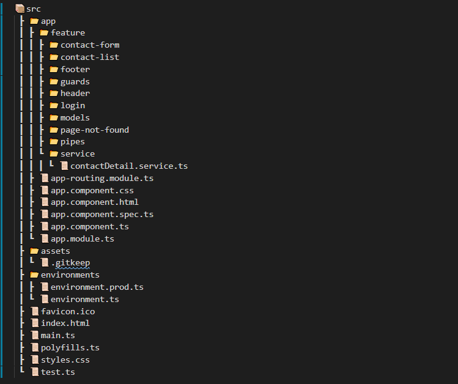

# Login Details 
- Email : ratan@test.com
- Password : 12345

# Instructions on how to run the application.

This project was generated with [Angular CLI](https://github.com/angular/angular-cli) version 8.3.12.

## Development server

Run `ng serve` for a dev server. Navigate to `http://localhost:4200/`. The app will automatically reload if you change any of the source files.

## Code scaffolding

Run `ng generate component component-name` to generate a new component. You can also use `ng generate directive|pipe|service|class|guard|interface|enum|module`.

## Build

Run `ng build` to build the project. The build artifacts will be stored in the `dist/` directory. Use the `--prod` flag for a production build.

## Running unit tests

Run `ng test` to execute the unit tests via [Karma](https://karma-runner.github.io).

## Running end-to-end tests

Run `ng e2e` to execute the end-to-end tests via [Protractor](http://www.protractortest.org/).

## Further help

To get more help on the Angular CLI use `ng help` or go check out the [Angular CLI README](https://github.com/angular/angular-cli/blob/master/README.md).

# Git Path
To clone Project (https://github.com/RatanKumar678/CRUDApp)

# Project Description:
Design and implement a production ready application for maintaining
contact information. Please choose the frameworks, packages and/or
technologies that best suit the requirements.
# Minimum expected functionality:
- List contacts
- Add a contact
- Edit contact
- Delete/Inactivate a contact

# Minimum Contact model fields:
- First Name
- Last Name
- Email
- Phone Number
- Status (Possible values: Active/Inactive)

# Points Cover In CRUD App:
- Reactive From (With all necessary validation)
- Lazy Loading (on contact-from)
- Routing
- Module (created two module contact-from and Contact-list and they have there on Routing Module)
- Pipe (To filter data for User List)
- Data Binding 
- Service (To handle common business Login on user list)
- Guards (Created to guards CanActivate and CanDeactivate)
- Model (Created contact interface)

# Directory structure
CRUDApp

📦src
 ┣ 📂app
 ┃ ┣ 📂feature
 ┃ ┃ ┣ 📂contact-form
 ┃ ┃ ┃ ┣ 📜contact-form-routing.module.ts
 ┃ ┃ ┃ ┣ 📜contact-form.component.css
 ┃ ┃ ┃ ┣ 📜contact-form.component.html
 ┃ ┃ ┃ ┣ 📜contact-form.component.ts
 ┃ ┃ ┃ ┗ 📜contact-form.module.ts
 ┃ ┃ ┣ 📂contact-list
 ┃ ┃ ┃ ┣ 📜contact-list-routing.module.ts
 ┃ ┃ ┃ ┣ 📜contact-list.component.css
 ┃ ┃ ┃ ┣ 📜contact-list.component.html
 ┃ ┃ ┃ ┣ 📜contact-list.component.ts
 ┃ ┃ ┃ ┗ 📜contact-list.module.ts
 ┃ ┃ ┣ 📂footer
 ┃ ┃ ┃ ┣ 📜footer.component.html
 ┃ ┃ ┃ ┗ 📜footer.component.ts
 ┃ ┃ ┣ 📂guards
 ┃ ┃ ┃ ┣ 📜authguard.guard.ts
 ┃ ┃ ┃ ┗ 📜contactCanDeactivate.gard.ts
 ┃ ┃ ┣ 📂header
 ┃ ┃ ┃ ┣ 📜header.component.css
 ┃ ┃ ┃ ┣ 📜header.component.html
 ┃ ┃ ┃ ┣ 📜header.component.spec.ts
 ┃ ┃ ┃ ┗ 📜header.component.ts
 ┃ ┃ ┣ 📂login
 ┃ ┃ ┃ ┣ 📜login.component.css
 ┃ ┃ ┃ ┣ 📜login.component.html
 ┃ ┃ ┃ ┣ 📜login.component.spec.ts
 ┃ ┃ ┃ ┗ 📜login.component.ts
 ┃ ┃ ┣ 📂models
 ┃ ┃ ┃ ┗ 📜contact.model.ts
 ┃ ┃ ┣ 📂page-not-found
 ┃ ┃ ┃ ┣ 📜page-not-found.component.css
 ┃ ┃ ┃ ┣ 📜page-not-found.component.html
 ┃ ┃ ┃ ┣ 📜page-not-found.component.spec.ts
 ┃ ┃ ┃ ┗ 📜page-not-found.component.ts
 ┃ ┃ ┣ 📂pipes
 ┃ ┃ ┃ ┗ 📜filter.pipe.ts
 ┃ ┃ ┗ 📂service
 ┃ ┃ ┃ ┗ 📜contactDetail.service.ts
 ┃ ┣ 📜app-routing.module.ts
 ┃ ┣ 📜app.component.css
 ┃ ┣ 📜app.component.html
 ┃ ┣ 📜app.component.spec.ts
 ┃ ┣ 📜app.component.ts
 ┃ ┗ 📜app.module.ts
 ┣ 📂assets
 ┃ ┗ 📜.gitkeep
 ┣ 📂environments
 ┃ ┣ 📜environment.prod.ts
 ┃ ┗ 📜environment.ts
 ┣ 📜favicon.ico
 ┣ 📜index.html
 ┣ 📜main.ts
 ┣ 📜polyfills.ts
 ┣ 📜styles.css
 ┗ 📜test.ts